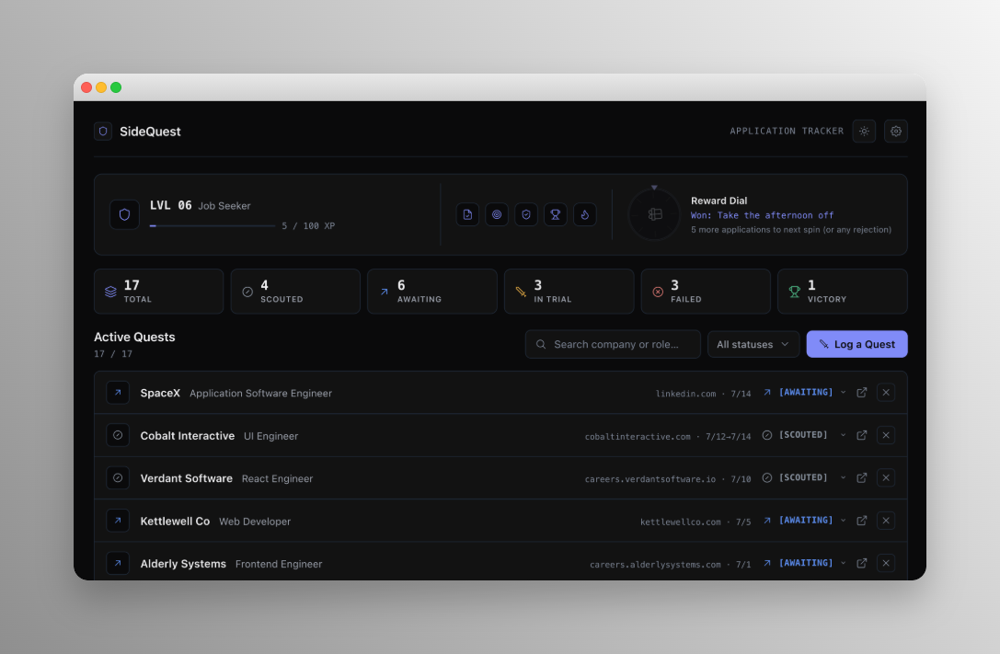
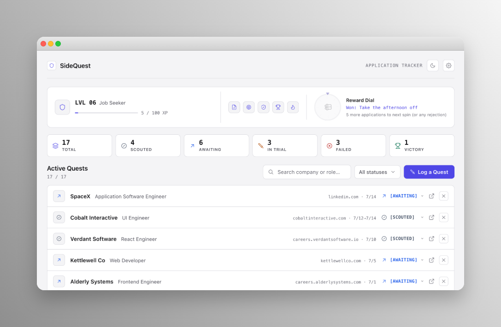
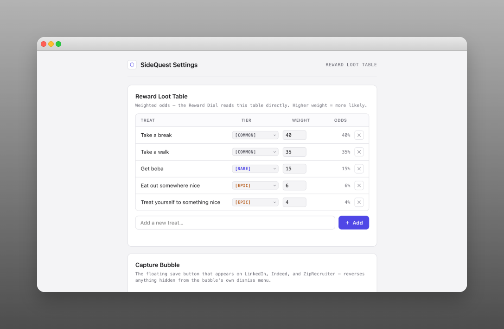
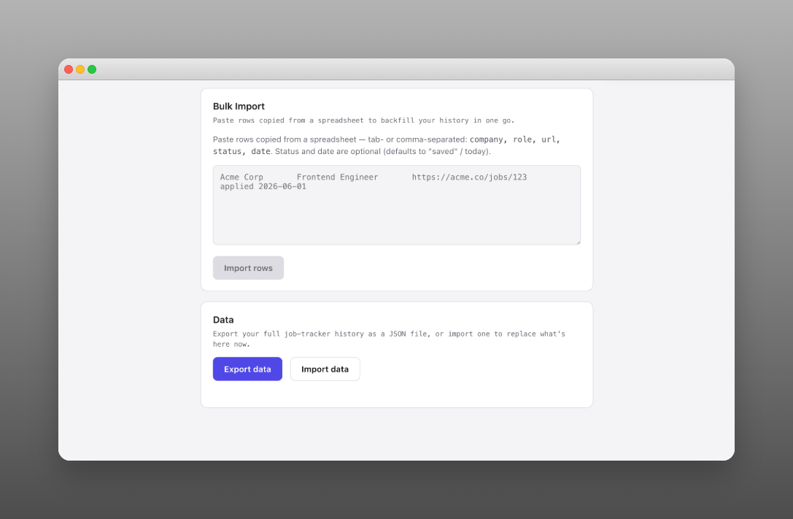

# SideQuest

A Chrome extension that turns job-search tracking into a game, so the grind of applying feels like progress instead of a black hole.

**[Install SideQuest from the Chrome Web Store](https://chromewebstore.google.com/detail/sidequest/kichojelgbbiimdocjngfcgpnofpcdcd)**



## What it does

Job searching means the same tedious loop over and over: find a posting, copy the company/role/link into a spreadsheet, apply, and then remember to go back and check on it later. SideQuest removes the copy-paste step and makes the whole thing less demoralizing:

- **One-click capture** — click the extension icon (or a small floating button that follows you around on LinkedIn, Indeed, and ZipRecruiter) to save whatever job posting you're looking at. No retyping company names and links by hand.
- **A real dashboard** — every saved application in one list: company, role, status, and a flag for anything that's gone quiet for too long.
- **XP, levels, and badges** — capturing a job, applying, and updating status all earn XP. Even a rejection earns "resilience XP," so a "no" still counts as forward motion instead of a dead end.
- **A reward wheel** — hit a milestone (every few applications, every level-up) and spin a wheel that lands on a small real-life reward you set for yourself — "get boba," "take the afternoon off," whatever keeps you going. It's just a suggestion generator; nothing gets ordered or booked automatically.

## Who it's for

Job seekers who are tired of tracking applications in a spreadsheet and want something that makes the process a little more bearable. It's a single-user, local-only tool — everything is stored on your own machine, no account, no server, no data leaving your browser.

## How to run it

### From the Chrome Web Store (easiest)

[Install SideQuest](https://chromewebstore.google.com/detail/sidequest/kichojelgbbiimdocjngfcgpnofpcdcd) and you're done — you'll see the SideQuest icon in your toolbar. Click it on any job posting to try capturing one, or open the dashboard from there to see the full tracker.

### From source

You'll need [Node.js](https://nodejs.org/) installed.

```bash
git clone https://github.com/thelensguy/sidequest.git
cd sidequest
npm install
npm run build
```

Then load it into Chrome:

1. Open `chrome://extensions` in Chrome.
2. Turn on **Developer mode** (top-right toggle).
3. Click **Load unpacked**.
4. Select the `dist` folder this project just built.

### While developing

- `npm run dev` — runs Vite in watch mode, so changes rebuild automatically (reload the extension in `chrome://extensions` to pick them up).
- `npm run test` — runs the test suite (unit tests for the XP/level/badge logic and the site-specific extraction adapters).

## How to use it

**Capturing a job.** On LinkedIn, Indeed, or ZipRecruiter, a small floating button follows you down the page — click it to save whatever posting you're currently viewing (it reads the title, company, and link straight off the page). Anywhere else, click the extension icon in the toolbar instead; if it can't automatically read all the details from the page, it falls back to a quick manual-entry form so nothing gets lost. Click the icon's dashboard button (top right of the popup) any time to jump to the full tracker.

**The dashboard.** Every saved application lands here: company, role, status, and how long it's been since anything changed (entries that have gone quiet get flagged). Click directly into a company/role/link to edit it inline, change status from the dropdown on each row, or use the status filter to show any combination of Scouted / Applied / Interviewing / Rejected / Offer at once. Add an entry by hand from the "Add entry" card if you want to backfill something you applied to before installing this.

**XP, levels, badges, the wheel.** Capturing, applying, and updating status all earn XP shown in the HUD strip at the top of the dashboard — including "resilience XP" for rejections, so a "no" still counts as forward motion. Hit a milestone (every few applications, every level-up) and the reward dial unlocks — spin it for a small real-life reward pulled from a list you define yourself (see Options below). It only ever displays a suggestion; nothing gets ordered, booked, or executed automatically.

**Light/dark theme.** Toggle it from the sun/moon icon in the dashboard's top bar, next to the settings gear — the choice is remembered and applies to the Options page too.



**Options page** (gear icon on the dashboard): customize the reward wheel's loot table (add/remove treats, adjust their odds) and control which sites show the floating capture button —



— paste in a batch of applications from a spreadsheet (tab- or comma-separated: company, role, url, status, date), and export your full history to a JSON file or import one back in — useful as a backup, or for moving your data to a fresh install. Importing replaces everything currently saved, so you'll get a confirmation prompt naming exactly how many entries are about to be replaced before it happens.



## How it's built

React + TypeScript, bundled with Vite via [CRXJS](https://crxjs.dev/) for Manifest V3. No backend — everything persists to `chrome.storage.local`. Job data is extracted per-site (LinkedIn, Indeed, ZipRecruiter) with a generic fallback for anywhere else, and the gamification logic (XP, levels, badges, the wheel) is written as plain, independently-tested functions that derive everything from a single event log rather than separate counters that could drift out of sync.
